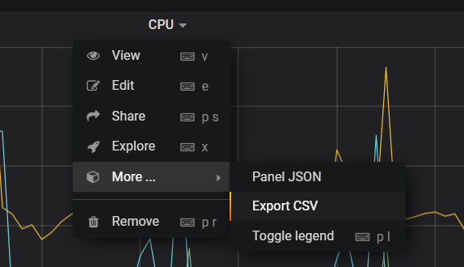
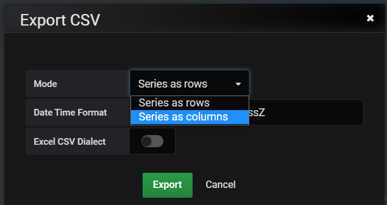
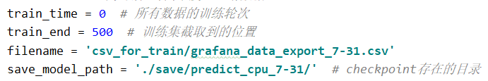

# predict_region
test_server是django程序，读取pd端口region信息，预测结果放在：http://0.0.0.0:8000  
在test_server目录下命令行输入：  

python manage.py runserver 0.0.0.0:8000 --noreload

# 获取数据
在集群上运行go-ycsb，然后从grafana监控中手动选择cpu监控数据做离线的训练。
如图在tikv面板下cluster下的cpu选择一个时间段，export csv

选择series as columns，然后export。

注意：这种方式导出的时间段不能超过6小时，否则数据就不是按每分钟间隔。
然后需要选择多个时间段导出，再手动拷贝整合到一个csv文件。

# 预训练
修改train_cpu.py中的以下几个参数，分别为训练次数，训练集测试集截取位置，
读取csv路径，保存模型路径。修改之后运行该文件训练。

训练后在save文件夹下会多一个文件夹，保存的是训练的模型，把它复制到test_server下的save里。
然后test_server/test_server/predict_tikv.py里改读取已保存的模型路径save_model_path，还有
看看计算期望节点数的参数averageUtilization需不需要改。

# 预测
预测需要在集群上，拷贝test_server这个django程序到集群上（包括预训练生成的文件夹），
需要先运行一段时间负载，然后激活环境：

conda activate szh   //激活hust虚拟环境

在manage.py同级目录下命令行输入：

python manage.py runserver 0.0.0.0:8000 --noreload st-2 pd-team-s2 10.233.18.170:9090 /data2/hust_tmp/cluster/tidb-cluster.yaml （端口号可以任意设置）

curl http://172.16.4.4:8000/tikv_replicas  //验证端口是否可以访问
